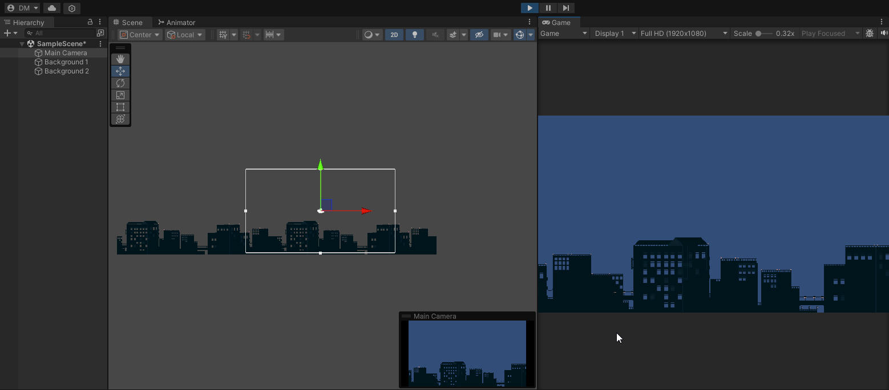
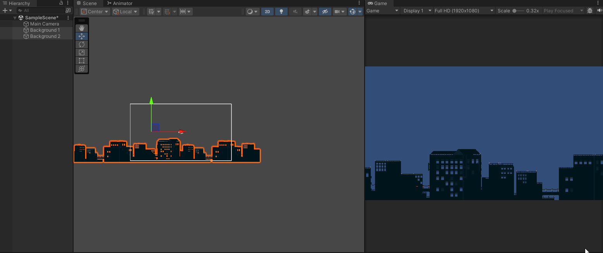
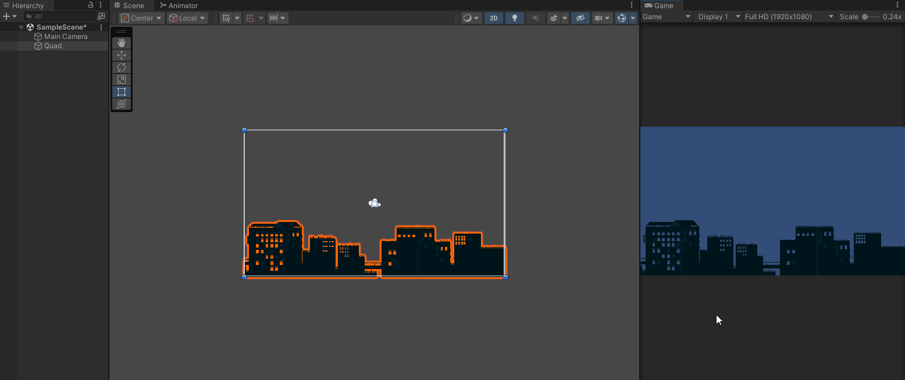
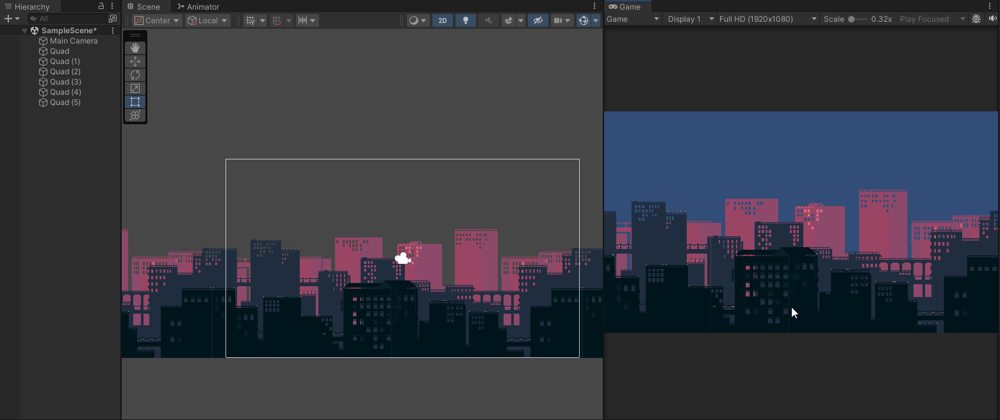
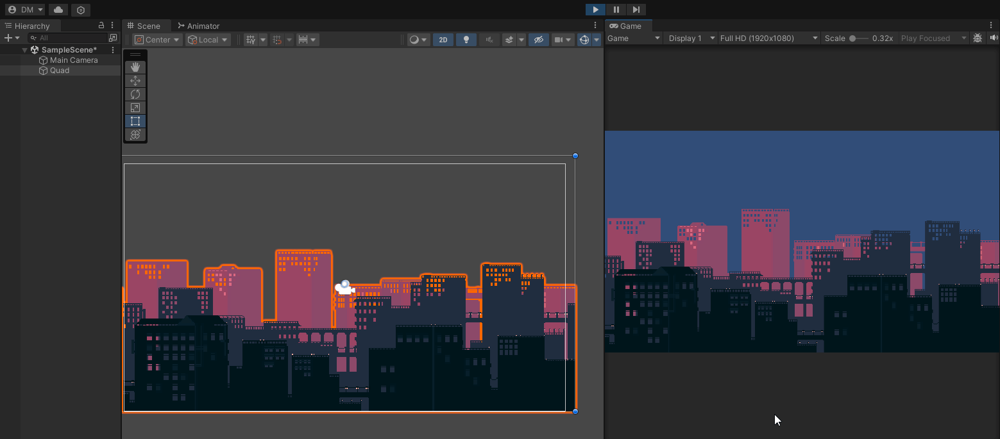
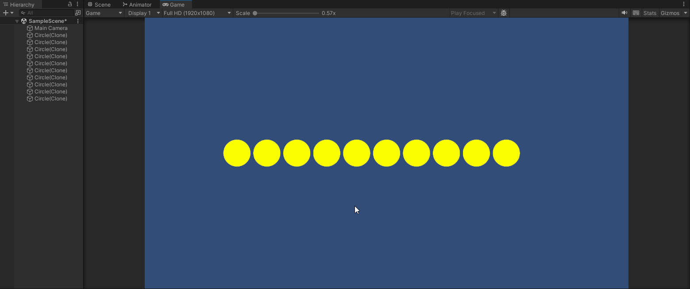

# Fundamentos del desarrollo de videojuegos
### Diego Herrera Mendoza
Técnicas

1. La cámara está fija, el fondo se va desplazando en cada frame. Se usan dos fondos. Uno de ellos lo va viendo la cámara en todo momento, el otro está preparado para el momento en que se ha avanzado hasta el punto en el que la vista de la cámara ya no abarcaría el fondo inicial. Por tanto, se va actualizando en todo momento la posición de los dos fondos, haciéndolos avanzar hacia la izquierda. Cuando la cámara alcanza el límite, se debe intercambiar el rol de los fondos. Aplicar un fondo con scroll a tu escena utilizando la técnica descrita.

Script: [BackgroundScrollTeleport](scripts/BackgroundScrollTeleport.cs)

2. La cámara se desplaza a la derecha y el fondo está estático. Existe nuevamente un fondo de reserva, que pasa a verse cuando el avance de la cámara sobrepasa el límite. El fondo anterior deb ubicarse a continuación del otro para que esté preparado. Aplicar un fondo con scroll a tu escena utilizando la técnica descrita en b.

Script: [BackgroundScrollTeleport](scripts/BackgroundScrollTeleport.cs), [CameraScroll](scripts/CameraScroll.cs)

3. Aplicar un fondo a tu escena aplicando la técnica del desplazamiento de textura.

Script: [BackgroundScrollMaterial](scripts/BackgroundScrollMaterial.cs)

4. Aplicar efecto parallax usando la técnica de scroll en la que se mueve continuamente la posición del fondo.

Script: [ParallaxBackgroundTeleport](scripts/ParallaxBackgroundTeleport.cs)

5. Aplicar efecto parallax actualizando el offset de la textura.

Script: [ParallaxBackgroundMaterial](scripts/ParallaxBackgroundMaterial.cs)

6. En tu escena 2D crea un prefab que sirva de base para generar un tipo de objetos sobre los que vas a hacer un pooling de objetos que se recolectarán continuamente en tu escena. Cuando un objeto es recolectado debe pasar al pool y dejar de visualizarse. Este objeto estará disponible en el pool. Cada objeto debe llevar un contador, cuando alcance 3 será destruido. En la escena, siempre que sea posible debe haber una cantidad de objetos que fijes, hasta que el número de objetos que no se han eliminado sea menor que dicha cantidad.

Script: [MyObjectPool](scripts/MyObjectPool.cs) , [CountingObject](scripts/CountingObject.cs)

7. Revisa tu código de la entrega anterior e indica las mejoras que podrías hacer de cara al rendimiento.

- Reducción del uso de GetComponent cacheando las variables como miembro de la clase para así no hacer llamadas constantes en Update.

- Utilizar CompareTag en lugar de el operador de equivalencia a la hora de comparar el tag de cualquier GameObject. De esta manera se evitan copias innecesarias.

- Para las strings, se podría hacer uso de String builder en lugar de la concatenación para la puntuación que se muestra en la interfaz de usuario.

- Establecer como estáticos los objetos que no se moverán

